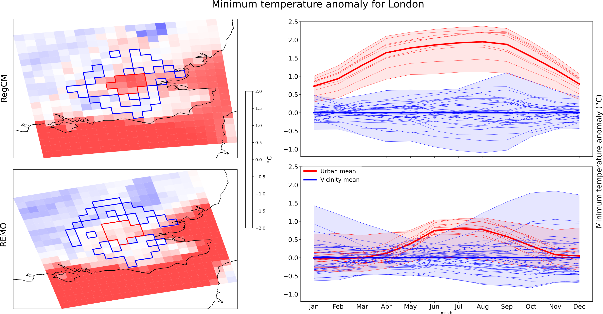

# Urban/Rural CLImate Mask definition (urclimask)

This repository provides a set of tools developed within the framework of the **CORDEX Flagship Pilot Study (FPS) on URBan environments and Regional Climate Change (URB-RCC)** to identify **urban** and surrounding **rural** areas from **climate model** outputs, tailored to specific cities of interest. The code includes functionalities to assess **Urban Heat Island (UHI)** intensity, with configurable parameters adaptable to different spatial resolutions and urban environments.



*Figure:* Urban Heat Island (UHI) for London using two Regional Climate Models. Red- and blue-bordered cells correspond to urban and rural areas delineated using the urclimask tool.

## Contents

| Directory | Contents |
| :-------- | :------- |
|  [urclimask](https://github.com/FPS-URB-RCC/urclimask/tree/main/urclimask) | Python code to delimitate urban/rural mask and assees Urban Heat Island analysys.
|  [notebooks](https://github.com/FPS-URB-RCC/urclimask/tree/main/notebooks) | Jupyter notebooks with examples on how to use the library for fiffenre RCMs and cities.
|  [CORDEX-CORE-WG](https://github.com/FPS-URB-RCC/urclimask/tree/main/CORDEX-CORE-WG) | Notebooks and resources used to generate the urban/rural mask database from CORDEX-CORE and CORDEX-EUR-11 within the framework of the CORDEX Flagship Pilot Study (FPS) on Urban Environments and Regional Climate Change (URB-RCC).
| [doc](https://github.com/FPS-URB-RCC/urclimask/tree/main/doc) | Description of the algorithm for urban/rural delimitation.

## Requirements

Scripts and (jupyter) notebooks are provided in [Python](https://www.python.org/) to ensure reproducibility and reusability of the results. The simplest way to match all these requirements is by using a dedicated [conda](https://docs.conda.io) environment, which can be easily installed by issuing:

```sh
git clone git@github.com:FPS-URB-RCC/urclimask.git
conda create -n urclimask
conda activate urclimask
cd urclimask
conda env update --file environment.yml --prune
pip install -e .
```

## Examples of use

Examples of use of the `urclimask` library are available in the form of [notebooks](https://github.com/FPS-URB-RCC/urclimask/tree/main/notebooks). To run the examples follow the following steps:

1. Download the folder [notebooks]() from the github repository, or navigate to the folder should you have cloned the repo.
2. Open jupyter notebook of Jupyter Lab (type `jupyter notebook` or `jupyter lab`  in the terminal)
3. Open one of the tests available in the [notebooks]() folder with jupyter notebook  (e.g. [paris_across_CORDEX_resolutions.ipynb](https://github.com/FPS-URB-RCC/urclimask/blob/main/notebooks/paris_across_CORDEX_resolutions.ipynb))

## Errata and problem reporting

To report an issue with the library, please fill a GitHub issue.

## License
Copyright 2023, European Union.

Licensed under the Apache License, Version 2.0 (the "License");
you may not use this file except in compliance with the License.
You may obtain a copy of the License at

    http://www.apache.org/licenses/LICENSE-2.0

Unless required by applicable law or agreed to in writing, software
distributed under the License is distributed on an "AS IS" BASIS,
WITHOUT WARRANTIES OR CONDITIONS OF ANY KIND, either express or implied.
See the License for the specific language governing permissions and
limitations under the License.
